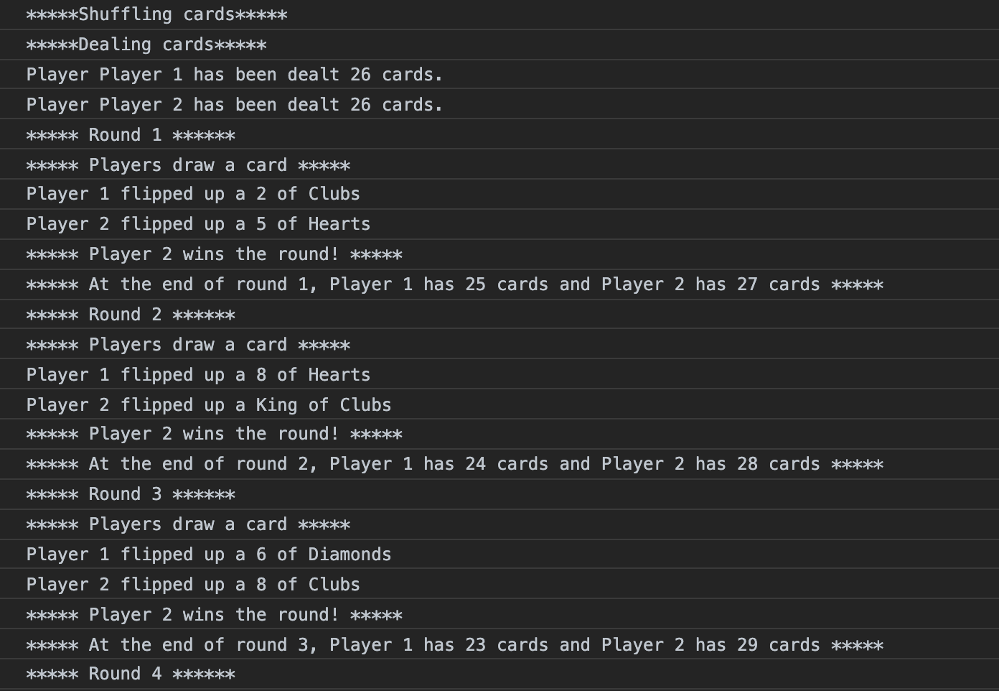
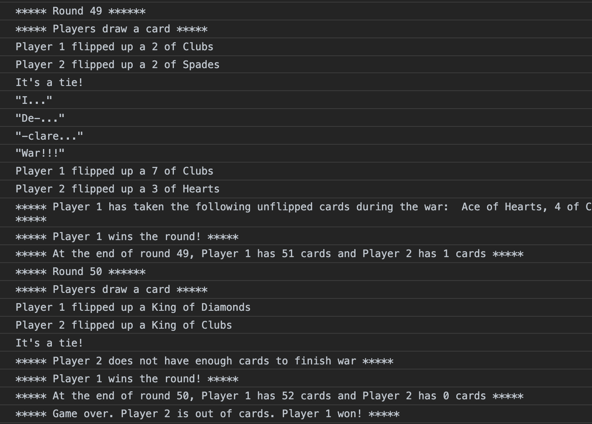

# war-card-game

The purpose of this repository was to build the classic card game "War" in javascript.

## Screenshots

## Built With

* Javascript
* HTML

## How to Run

1. Fork and clone repository.

2. Open index.html in Chrome.

3. Open developer tools by selecting "More Tools" then "Developer Tools" in the Chrome menu in the browser.

  * Alternatively, you can use the keyboard shortcuts <kbd>command</kbd> + <kbd>option</kbd>  + <kbd>i</kbd> 
  
  4. Click the console tab in the developer tools to see the game output.
  
## Contributing

If you have any comments or suggestions please feel free to contact me. 

## Authors

* Lorenzo Lucas 
